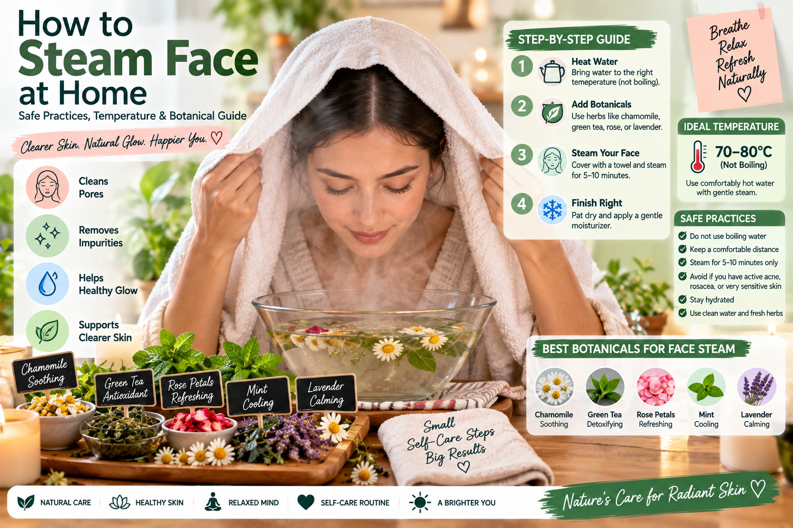

A facial steam can feel like a relaxing spa ritual right in your own bathroom. The gentle warmth helps soften the outer layer of skin and creates a soothing environment for unwinding. However, hot water and delicate facial skin require careful handling. Knowing how to steam face at home safely ensures you protect your skin barrier while enjoying a comforting, aromatic routine.

Before pouring boiling water into a bowl, it helps to understand what a steam can and cannot do for your skin. While it offers temporary hydration and relaxation, it does not physically melt away sebum or permanently shrink pores. Approaching facial steams with realistic expectations makes it easier to focus on comfort and safety rather than aggressive transformation.

> **[Green Tea for Oily Skin: Benefits, Uses, and Acne Care Guide](https://healthbel.com/green-tea-for-oily-skin-benefits-uses-and-acne-care/)**
>
> Green Tea for Oily Skin: Find out how this natural ingredient may help reduce excess oil, soothe acne-prone skin, and become a simple part of your daily skincare routine.
>
> 

## Understanding Temperature and Burn Prevention

The single most important factor in a safe DIY facial steam is water temperature. Steam can easily scald delicate facial tissue, the eyes, and the sensitive skin of the neck. Never lean directly over vigorously boiling water, and never place your face closer than 10 to 12 inches from the water's surface.

To set up a safe steam:

- Boil your water in a stable pot or kettle, then remove it entirely from the heat source.
- Let the water rest for a few minutes so it stops rolling and bubbling aggressively.
- Transfer the water to a sturdy, heat-safe ceramic or glass bowl placed securely on a flat table or counter.
- Test the steam carefully with the back of your hand before bringing your face near the bowl. It should feel comfortably warm, never painfully hot or stinging.
Keep your eyes tightly closed during the session to avoid irritation from warm vapor or essential oils. Limit your steaming time to five or ten minutes maximum. If your skin starts to feel hot, flush, or uncomfortable, stop immediately.

## Choosing Botanical Additives Wisely

Adding herbs or flowers to your steaming water can elevate the sensory experience with gentle natural aromas. However, natural ingredients are not automatically safe for everyone. Plants can carry allergens or irritants, particularly when concentrated in warm vapor.

Gentle culinary and cosmetic herbs often used in steams include dried chamomile flowers, calendula, or lavender buds. Use small quantities—typically a tablespoon of dried herbs—rather than large handfuls. If you have known seasonal allergies or hypersensitive skin, skip the botanicals entirely and stick to plain water.

**Safety Note:** Avoid adding pure, undiluted essential oils directly to steaming water. Essential oils are highly concentrated plant extracts that can vaporize intensely, potentially irritating the respiratory tract or stinging the eyes and skin. If you wish to use aromatherapy, consult a qualified professional or use properly diluted products instead of dropping raw oils into boiling water.

## Step-by-Step Guide: How to Steam Face at Home

A successful home facial steam is simple when approached with patience and proper preparation. When learning how to steam face at home, follow these steps for a comfortable, low-risk session.

- **Cleanse first:** Wash your face gently with a mild cleanser to remove surface dirt, makeup, and oils. Steaming with makeup on can trap debris against the skin.
- **Prepare the station:** Place your heat-safe bowl on a stable surface. Add your water and optional dried herbs, allowing the steam to rise gently.

- **Position yourself:** Sit comfortably and hold your face 10 to 12 inches away from the water. Drape a clean towel over the back of your head to create a loose tent that traps the warmth, but leave space on the sides so air circulates freely.

- **Keep it brief:** Relax for five to seven minutes. Pay attention to how your skin feels.

- **Finish gently:** Pat your face dry with a clean, soft towel. Apply a gentle moisturizer immediately afterward to help lock in hydration while the skin is still slightly damp.

> **[Best Fruits for Healthy Skin: Natural Guide for Glowing Skin](https://healthbel.com/best-fruits-for-healthy-skin-natural-guide/)**
>
> Best Fruits for Healthy Skin help you improve natural glow, hydration, and clarity. Discover vitamin-rich fruits that support clear, radiant, and healthy skin daily.
>
> 

## Common Mistakes and What to Avoid

It is easy to overdo a good thing when experimenting with at-home self-care routines. Avoiding a few common mistakes will keep your skin happy and balanced.

Steaming too frequently is a frequent pitfall. Doing this daily can strip natural moisture and disrupt the skin barrier, leading to dryness or irritation. Once a week or even bi-weekly is more than enough for most skin types. Additionally, master how to steam face at home without resorting to vigorously scrubbing or using harsh physical exfoliants right after steaming, as your skin may be temporarily more sensitive.

## Who Should Skip Facial Steams?

Facial steams are not suitable for everyone. Heat and warm vapor can dilate superficial blood vessels and aggravate certain skin conditions.

If you live with rosacea, chronic eczema, severe active acne, or extremely sensitive, reactive skin, high heat can trigger flare-ups, redness, and inflammation. Those using prescription retinoids or strong chemical exfoliants should also exercise caution, as their skin barrier is already working hard to shed dead cells and may react poorly to intense heat.

## When to Seek Professional Help

At-home cosmetic routines are meant for relaxation and general upkeep, not for treating medical skin conditions. If you are dealing with persistent cystic acne, unexplained rashes, chronic burning, stinging, or sudden changes in skin texture, consult a board-certified dermatologist. A professional can provide an accurate evaluation and recommend a personalized skincare plan tailored to your specific needs.

> **[Natural Skin Brightening Tips for Healthy & Glowing Skin Naturally](https://healthbel.com/natural-skin-brightening-tips/)**
>
> Discover the best natural skin brightening tips for healthy and glowing skin naturally using aloe vera, turmeric, vitamin C, and simple skincare remedies.
>
> 

> **[HealthBel Blog | Latest Health & Wellness Articles](https://healthbel.com/blog/)**
>
> Explore the HealthBel blog for the latest health, wellness, nutrition, fitness, beauty, and healthy lifestyle articles to support your well-being.
>
> 

## Trusted health resources

- [World Health Organization health topics](https://www\.who.int/health-topics)
- [NHS health conditions and guidance](https://www\.nhs.uk/conditions/)