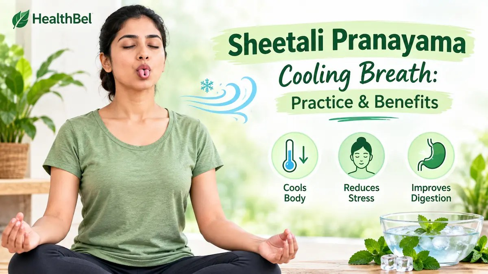

When summer temperatures climb or a wave of sudden frustration takes hold, the body often reacts with physical signs of heat. Flushed skin, a racing pulse, and a tight chest can make it difficult to think clearly. While many people reach for a cold glass of water or step into the air conditioning, yoga philosophy offers an internal tool for temperature regulation and nervous system soothing: cooling breath. Known as Sitali or sheetali pranayama cooling breath, along with its companion technique Sitkari (sheetkari), these traditional practices are designed specifically to counteract internal heat and mental irritability. By altering how air enters the mouth, these exercises influence physical sensations and encourage a calmer state of mind.

## Understanding Cooling Breath Practices

Most breathing exercises in yoga involve inhaling through the nose, which filters, warms, and humidifies the air before it reaches the lungs. Cooling pranayama techniques intentionally break this rule. By drawing air across the moist surface of the tongue or through clenched teeth, the incoming air is physically cooled through evaporation before entering the respiratory tract.

Beyond the direct temperature effect, controlled slow breathing stimulates the vagus nerve, which helps shift the body away from a stress response. When you feel hot, irritable, or overwhelmed, your nervous system is often stuck in a high-alert state. Practicing a deliberate cooling breath acts as a physical cue to slow down, lower your heart rate, and release accumulated tension.

## How to Practice Sheetali Pranayama Cooling Breath

Sheetali translates roughly to 'cooling' or 'soothing'. The defining feature of this technique is curling the edges of the tongue to form a tube. Not everyone has the genetic ability to roll their tongue lengthwise; if you cannot, do not worry—you can use the alternative sheetkari method instead.

  - Find a comfortable seated position with a straight spine, either on the floor or in a chair. Relax your shoulders and rest your hands on your knees. Close your eyes and take a few normal breaths to settle into the present moment.

  - Open your mouth and extend your tongue slightly outside your lips. Curl the outer edges upward so it resembles a small tube or straw.

  - Inhale slowly and steadily through the tubular tongue, drawing air inward. You may notice a distinct cooling sensation as the air passes over the wet tongue surface.

  - At the end of a comfortable inhalation, draw the tongue back inside, close your mouth, and exhale completely and smoothly through your nose.

  - Repeat this cycle for 5 to 10 rounds, observing the physical shift in your body.

> **[Pranayama Benefits and Breathing Techniques for Better Health](https://healthbel.com/pranayama-benefits-types-breathing-techniques/)**
>
> Learn Pranayama benefits, types, and breathing techniques. Discover easy daily practices to improve focus, sleep, and overall health.
>
> 

## How to Practice Sheetkari Pranayama

If your tongue does not curl naturally into a tube, sheetkari is the ideal alternative. Instead of curling the tongue, you draw air through your teeth.

  - Sit comfortably with your spine tall and your shoulders relaxed. Bring your upper and lower teeth together gently so they lightly touch.

  - Part your lips so your teeth are exposed to the air. Place the tip of your tongue gently behind your front teeth.

  - Inhale slowly through the gaps in your teeth. This creates a soft hissing sound and cools the incoming air as it passes over the tongue and teeth.

  - Close your mouth and exhale completely through your nose in a slow, controlled manner. Continue for several rounds, focusing on the sound and the cool feeling of the breath.

## Managing Irritability and Mental Heat

Frustration and anger often manifest physically as a rush of heat to the head and face. When anger flares, breathing naturally becomes shallow and rapid, which further fuels agitation. Utilizing sheetali pranayama cooling breath interrupts this feedback loop. The physical act of drawing air through a narrow channel forces you to slow your breathing pace down. Because you must pay attention to the tongue position or the teeth alignment, your mind temporarily steps away from the source of irritation. This brief pause creates enough mental space to respond to a situation with composure rather than reacting out of frustration.

**Practice Note:** Cooling pranayama techniques are potent tools, but they should be practiced with awareness. Because these exercises actively reduce internal heat, they are best suited for hot weather, post-exercise recovery, or moments of acute emotional heat.

## Precautions, Limitations, and When to Avoid It

While sheetali pranayama cooling breath and sheetkari are generally safe for most healthy adults, they are not appropriate for every situation or climate. Understanding their limitations ensures you use them safely and effectively.

  - **Cold Climates and Winter Months:** Avoid practicing cooling breaths in cold weather or if you are already feeling chilled, as they can lower your internal temperature further.

  - **Respiratory Issues:** Individuals dealing with asthma, severe bronchitis, or heavy congestion should approach mouth-breathing techniques cautiously, as cool, unfiltered air can sometimes irritate sensitive airways.

  - **Low Blood Pressure:** Because these practices strongly activate the calming branch of the nervous system, anyone with chronically low blood pressure should monitor how they feel and stop if they experience lightheadedness.

  - **Environmental Factors:** Do not practice cooling breaths in heavily polluted or dusty environments, since drawing air directly through the mouth bypasses the nose's natural filtration system.

## When to Seek Professional Help

Using breathing exercises is a wonderful way to manage everyday stress, seasonal heat, and occasional irritability. However, breathwork is not a substitute for medical or psychological care. If you experience chronic, unmanageable anger, persistent panic attacks, or severe mood disruptions that interfere with your daily life, consider reaching out to a licensed healthcare professional or mental health counselor. Similarly, if physical symptoms like overheating, dizziness, or fatigue do not resolve with rest and hydration, consult a doctor to rule out underlying medical conditions.

> **[HealthBel - Health, Fitness & Wellness Tips](https://healthbel.com/)**
>
> Trusted health, fitness, nutrition, yoga, beauty, and wellness tips for a healthy lifestyle.
>
> 